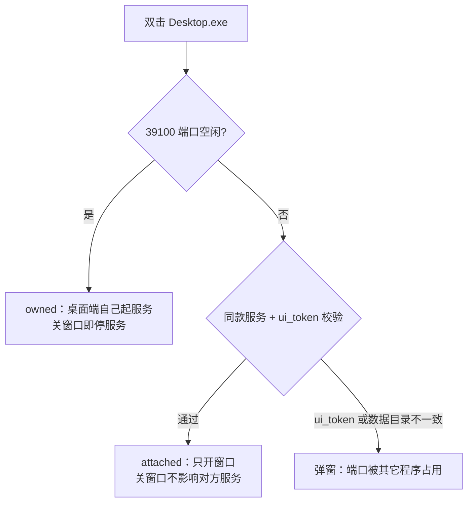
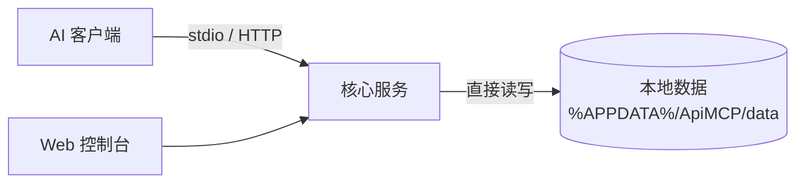

# API MCP v2.0.0

Windows 版本地 API 设计与调试工具，内置 MCP 服务。自带数据目录，不依赖任何其它软件。

## 特性

- **34 个工具** — `apimcp_list_projects` … `apimcp_export_project`
- **开箱即用** — 首次启动自动建好数据目录和一个「默认项目」，打开就能写接口
- **导入导出** — 导入 OpenAPI 3.x / Swagger 2.0 / Postman Collection v2.1 / HAR / cURL，以及 AI 解析任意文本与请求代码；导出 OpenAPI 3.0（JSON / YAML）、Postman v2.1、Markdown、HTML、Word
- **可视化接口编辑器** — 控制台内直接新建/编辑/删除接口、目录、文档，含参数表、Body、鉴权、前后置脚本、响应示例
- **接口树交互对齐 Apipost** — 双击就地改名、右键菜单（打开 / 重命名 / 复制 / 删除 / 在此新建）、搜索过滤、目录折叠、拖拽排序与跨目录移动
- **代码生成** — 一键把当前请求转成 cURL / fetch / axios / Python / Go / Java 六种可运行代码
- **自动化测试** — 执行计划编排，支持条件 / 次数 / While / 等待 / 脚本五种控制器任意嵌套，运行后输出可视化报告
- **AI 辅助（可选）** — 兼容 OpenAI 风格的任意服务：AI 解析导入、AI 起草接口、AI 生成测试用例
- **环境管理** — 多环境切换、环境变量、多 host 服务（前置 URL）；目录可指定服务，其下接口优先使用
- **全局参数与全局变量** — 全局 / 目录 / 接口三层继承（Header、Query、Body、鉴权、前后置脚本），环境变量优先于全局变量；Cookie 统一写在 Header 的 `Cookie` 键
- **完整 apt 脚本沙箱** — `apt.environment/globals/variables`、`setRequestHeader/Query/Body`、`response.json/text`、`cookies`、`apt.test/apt.expect`
- **Apipost 同款主题** — 暖纸金（默认）/ 暗色 / 自定义底色，配色取自 Apipost 主题 token
- **双模式** — 常驻 HTTP 服务（含 Web 控制台）+ `--stdio`（供 MCP 客户端直连）
- **完全独立** — 数据全部落在自己的目录里，不读写本机任何其它软件的文件
- **单文件交付** — `dist/apimcp.exe`，运行时零依赖
- **可选的桌面端** — Electron 独立窗口，双击即用，不需要浏览器标签页

## 快速开始（用打包好的 exe）

不需要装 Node，也不需要 `npm install`，直接拿产物即可：

| 产物 | 位置 | 适合谁 |
|---|---|---|
| **桌面端（独立窗口）** | `dist/desktop/ApiMCP-Desktop-win32-x64.zip` | 想要一个像普通软件那样的窗口（zip 内已含 `apimcp.exe`） |
| **命令行 / 浏览器版** | `dist/apimcp.exe` | 给 AI 客户端当 MCP 服务用，或习惯在浏览器里操作 |

两者数据完全共享，用哪个都行，也可以同时用。

## 功能地图

| 我想… | 去哪 |
|---|---|
| 写接口、改参数、发请求 | 接口设计 → 设计 / 调试 |
| 改接口名、删除、复制、拖到别的目录 | 接口设计左树：双击改名、右键菜单、拖拽 |
| 把请求转成 Java / Go / Python 代码 | 接口设计 → 调试 → 生成代码 |
| 把多个接口串成流程、加条件与循环 | 自动化测试 |
| 把文档发给别人 | 导入导出 → 导出 Markdown / HTML / Word，或「打开文档页」打印成 PDF |
| 导入别人给的接口文档 | 导入导出 → 粘贴内容或上传文件 |
| 粘贴一段 Java 代码或网页文字变成接口 | 导入导出 → 格式选「AI 解析」（需先启用 AI） |
| 一句话生成一个接口 | 接口设计工具条 →「✦ AI 起草接口」 |
| 批量生成测试用例 | 接口设计 → 接口用例 →「✦ AI 生成用例」 |
| 切换环境、改变量 | 环境与变量 |
| 让 Cursor 等 AI 客户端调用这些接口 | 客户端配置 |
| 打开或关闭 MCP 服务 | 总览

### 前置条件

无需任何前置条件。**首次启动会自动创建数据目录 `%APPDATA%\ApiMCP\data\` 和一个名为「默认项目」的项目**，打开控制台即可直接写接口。

> 想把数据放在别处（含绿色便携）：用 `--data-root` 指定，或在控制台「外观设置 → 数据目录」里改，或设环境变量 `APIMCP_HOME` 让配置与数据一起跟着目录走。

### 方式一：`apimcp.exe`（浏览器控制台）

**双击运行**即可，它会：

1. 起一个本地服务（默认 `127.0.0.1:39100`）
2. 自动用系统默认浏览器打开控制台，地址形如 `http://127.0.0.1:39100/?ui=<token>`

终端里会打印这些信息，其中 `?ui=<token>` 就是控制台入口，**不要漏掉**（没有 token 打不开控制台）：

```
  API MCP 服务已启动
  数据目录: C:\Users\<你>\AppData\Roaming\ApiMCP\data（首次已初始化）
  控制台  : http://127.0.0.1:39100/?ui=xxxxxxxx
  MCP 端点: http://127.0.0.1:39100/mcp
  Token   : xxxxxxxx
  配置    : C:\Users\<你>\AppData\Roaming\ApiMCP\config.json
```

> 双击后如果只弹出一个黑框，说明服务已在运行，**别关这个窗口**——关了服务就停了。

```powershell
# 常用启动方式
.\apimcp.exe                         # 起服务 + 打开浏览器
.\apimcp.exe --serve                 # 只起服务，不打开浏览器
.\apimcp.exe --serve --port 39101    # 换端口
.\apimcp.exe --data-root "D:\data"   # 指定数据目录
.\apimcp.exe --help                  # 查看全部参数
```

**首次使用建议顺序**：双击 exe → 浏览器打开控制台（已有「默认项目」，可直接开写）→「总览」打开 **MCP 服务开关**（默认关闭）→ 勾选要开放的项目 → 开始用。

> 服务默认处于**停用**状态，首次使用需要手动打开「总览」里的运行开关；开启后 HTTP 与 stdio 两种接入方式才可用。
>
> 「默认项目」只是省去第一步，可以改名、删除，也可以再建更多项目。
### 方式二：`ApiMCP-Desktop.exe`（独立窗口）

双击 `ApiMCP-Desktop.exe` 即可，无地址栏、无标签页，关窗口等于关这个软件。

> 分发时把 `ApiMCP-Desktop-win32-x64.zip` 整个发出去，或**整个 `ApiMCP-Desktop-win32-x64` 目录一起拷贝**（约 360 MB，含 Electron 运行时与 `apimcp.exe`）。只拿一个 exe 会打不开。

它和你已有的 `apimcp.exe` 的关系：

| 情况 | 行为 |
|---|---|
| 39100 端口空闲 | 桌面端自己起服务，**关窗口即停服务** |
| `apimcp.exe` 已在跑 | 自动「附着」，只开窗口，**关窗口不影响那边** |
| 端口被别的程序占了 | 弹窗提示，用 `--port` 换端口 |

桌面端支持同样的 `--port` / `--data-root`。

```powershell
# 用快捷方式或命令行带参数启动
ApiMCP-Desktop.exe --port 39101
```

### 配到 AI 客户端（Cursor / Claude Code / VS Code / Trae / Codex）

不用手写配置：打开控制台 → 左侧「**客户端配置**」→ 选你的客户端 → 点复制 → 粘到对应文件里。

以 Cursor 为例，粘到 `%USERPROFILE%\.cursor\mcp.json`：

```json
{
  "mcpServers": {
    "apimcp": {
      "command": "D:\\path\\to\\dist\\apimcp.exe",
      "args": ["--stdio"]
    }
  }
}
```

> `--stdio` 由客户端自己拉起进程，**不需要**先双击 exe。`command` 要写**绝对路径**。

### 数据在哪

| 内容 | 路径 |
|---|---|
| 项目数据（读写） | `%APPDATA%\ApiMCP\data\` |
| 本软件配置 | `%APPDATA%\\ApiMCP\config.json` |
| 桌面端窗口位置记忆 | `%APPDATA%\\ApiMCP\desktop-window.json` |

首次启动自动创建，改动直接写入该目录，保存即时生效。

数据目录内部结构（沿用 Apipost 的序列化格式，便于按需导入导出）：

```
%APPDATA%\ApiMCP\data\
├─ offline-projects.json       项目索引
├─ offline-data\{project_id}\  各项目数据（project.json / apis / envs / global_params / settings / executions）
└─ offline-data-local\         本地元信息（meta.json 默认团队、teams.json、projects\ 运行时变量）
```

## 全局参数与变量

控制台「环境与变量」页分三个页签：环境、全局参数、全局变量，每个页签底部都有一段可折叠的使用说明。

### 变量引用

任何参数值、URL、Body、鉴权、脚本里都可以用 `{{变量名}}` 引用变量；变量值本身还能再嵌套 `{{...}}`，最多递归 5 层（防死循环）。

内置变量无需定义，每次渲染即时生成：

| 变量 | 说明 |
|---|---|
| `{{$timestamp}}` | 秒级时间戳 |
| `{{$timestampMs}}` | 毫秒时间戳 |
| `{{$randomInt}}` | 0-999 随机整数 |
| `{{$uuid}}` / `{{$guid}}` | 随机 UUID |
| `{{$isoDate}}` | ISO 8601 时间 |

### 环境变量与全局变量

| 层级 | 生效范围 | 位置 |
|---|---|---|
| **环境变量** | 只在当前环境生效 | 「环境与变量 → 环境」的变量表 |
| **全局变量** | 整个项目生效 | 「环境与变量 → 全局变量」 |

取值优先级（高 → 低）：

```
环境 current_value > 环境 value > 全局 current_value > 全局 value
```

「默认值」是基线配置，「当前值」是运行时实际取用的值；脚本 `apt.environment.set` / `apt.globals.set` 写入的是当前值，清空当前值会回落到默认值。

### 全局参数

全局参数对项目下每个接口生效，按「全局 → 目录 → 接口」三层继承：

- **Header / Query**：按 key 求并集，同名内层优先；内层取消勾选（`is_checked = -1`）表示禁用外层同名项
- **Body**：只支持 `form-data` 与 `urlencoded`
- **鉴权**：从内往外找第一个不是 `inherit` 的类型
- **脚本**：前置按 `全局 → 目录 → 接口`，后置按 `接口 → 目录 → 全局`

### Cookie 写法

Cookie 不再有独立的参数表（接口 / 目录 / 全局参数三处界面都只保留 Query、Path、Header），统一写成一条 Header：

| Key | Value |
|---|---|
| `Cookie` | `a=1; b=2` |

粘贴 cURL（`-b` / `--cookie` / `-H 'Cookie: ...'`）或导入 OpenAPI 时，cookie 会自动合并成一条 `Cookie` 请求头。

历史数据里的 Cookie 参数不会自动迁移：界面会用提示块列出，可「复制为 Cookie 头」粘到 Header 后再「清空历史 Cookie 参数」。在这些数据清空之前，它们仍会在发送时合并进 `Cookie` 头。

### 跨步骤传值

在登录接口的后置脚本里写入变量，后续接口用 `{{...}}` 引用：

```js
// 步骤 1 后置脚本
apt.environment.set("token", apt.response.json().token);
```

```
// 步骤 2 的 Header
x-access-token: {{token}}
```

## 从源码构建

```powershell
npm install
npm run build          # → dist/apimcp.exe
npm run build:desktop  # → dist/desktop/ApiMCP-Desktop-win32-x64/ + 同名 zip（约 6 分钟）
```

> `build:desktop` 会把 `dist/apimcp.exe` 一起拷进桌面端目录并打成 zip，所以先跑 `build` 再跑 `build:desktop`。产物大小约：`apimcp.exe` 89 MB、桌面端 zip 184 MB。

改完 `web/` 下的任何文件后必须重跑 `npm run build`（或 `node scripts/gen-assets.mjs`），因为控制台资源是内联进 exe 的。

新增前端脚本要同步改三处：`web/index.html` 的 script 标签、`scripts/gen-assets.mjs` 的 `files` 数组、`src/server/serve.js` 里静态资源路由的正则。

## 接口树交互

「接口设计」左侧的树按 Apipost 的方式操作：

| 手势 | 行为 |
|---|---|
| 单击 | 打开该接口 / 目录 / 文档 |
| **双击名称** | 就地改名，回车或失焦立即落库，Esc 取消 |
| **右键** | 弹出菜单：打开、重命名、复制、删除；目录额外提供「在此新建接口 / 目录 / 文档」 |
| 拖拽 | 拖到目录行中间 = 移入该目录；拖到行的上 / 下缘 = 同级插入前后；禁止把目录拖进自己的子树 |
| 点折叠箭头 | 收起 / 展开该目录（重绘后保持） |

顶部搜索框按名称、URL、方法或 ID 过滤，命中的节点会连同祖先链一起保留；没有命中时显示「没有匹配的接口」。

「复制」是在同目录生成一份「xxx 副本」，参数、Body、鉴权、脚本、用例与 Mock 一并复制（目录只复制自身，不含子项），不经过剪贴板。

元信息栏的字段顺序是：**接口名称 → 状态 → 目录 → 标签**。改「接口名称」时侧栏标题实时跟随，与「基础 → 名称」三处始终一致。

## 代码生成

调试页签的响应区有「生成代码」按钮，把本次实际发出的请求转成六种可运行代码：

| 语言 | 产出 |
|---|---|
| cURL | bash 方言，与「复制为 cURL」保持一致 |
| JavaScript | `fetch` / `axios` 两种写法 |
| Python | `requests` |
| Go | `net/http` |
| Java | `OkHttp` |

请求里的 `{{变量}}` 会原样保留，不会解析成实际值——粘到代码里后由你自己决定怎么注入。`form-data` 与 `binary` 这类无法用文本还原的模式会给出 warning，而不是编造一份假数据。上次选的语言会记住。

## 自动化测试

控制台左侧「自动化测试」把多个接口串成一条业务流程，支持控制器嵌套，运行后看可视化报告。

### 节点类型

| 类型 | 说明 |
|---|---|
| 接口步骤 | 引用项目里的 HTTP 接口，保存时固化一份快照，之后改接口不影响已排好的步骤 |
| 条件控制器 | 填 JS 表达式，为真走「成立时」分支，否则走「否则」分支 |
| 次数控制器 | 按指定次数重复执行子节点，循环体内可用 `{{$index}}`（从 0 起）/ `{{$iteration}}`（从 1 起） |
| While 控制器 | 每轮开始前求值，为真继续循环；`max_iterations` 兜底防死循环，达到上限会强制退出并在报告里提示 |
| 等待控制器 | 延迟指定毫秒 |
| 脚本控制器 | 只跑脚本不发请求，断言照常收集 |

### 条件怎么写

条件是一个 JS 表达式，可用对象与脚本沙箱完全一致：

```js
apt.response.code() === 200
apt.response.json().code === 0
apt.variables.get("token") !== ""
apt.response.json().data.length > 0
```

### 跨步骤传值（自动化计划内）

在步骤的后置脚本里写入变量，后续步骤用 `{{...}}` 引用：

```js
// 第 1 步（登录）的后置脚本
apt.environment.set("token", apt.response.json().token);
```

```
// 第 2 步的 Header
x-access-token: {{token}}
```

### 失败策略

默认「失败继续」——某步失败后仍执行后续步骤，便于一次看清整条链路哪里断了。勾选「失败即停」后，第一个失败会中止剩余步骤，被跳过的节点在报告里标记为「跳过」而不是静默丢弃。

### 执行报告

报告与计划结构同构：控制器按层级展开，循环能看到每一轮的子节点，条件会显示求值结果与走了哪个分支。每个节点给状态、耗时、状态码、断言明细与错误信息。

### 兼容性

历史计划里的步骤没有 `type` 字段，一律按普通接口步骤执行，**不需要迁移**，老计划可以直接跑。

## AI 辅助（可选）

默认关闭。到「外观设置 → AI 设置」填 API 地址、模型与 API Key 后启用。

任何 OpenAI 风格的服务都能接：

| 服务 | API 地址 | 模型示例 |
|---|---|---|
| OpenAI | `https://api.openai.com/v1` | `gpt-4o-mini` |
| DeepSeek | `https://api.deepseek.com/v1` | `deepseek-chat` |
| 通义千问 | `https://dashscope.aliyuncs.com/compatible-mode/v1` | `qwen-plus` |
| 本地 Ollama | `http://127.0.0.1:11434/v1` | `qwen2.5` |

填完可点「测试连通性」验证。

### 三个能力

| 入口 | 作用 |
|---|---|
| 导入导出 → 格式选「AI 解析」 | 粘贴任意内容（自然语言描述、Java / Go / .NET / Python 请求代码、网页复制的文档片段），提取成可调试的接口 |
| 接口设计工具条 →「✦ AI 起草接口」 | 一句话描述需求，生成方法、URL、参数、Body 与响应示例 |
| 接口用例面板 →「✦ AI 生成用例」 | 基于接口参数与响应示例设计正常 / 异常用例 |

三者都是「先生成、预览、确认后才落库」，AI 产生的内容不会直接写进项目数据。

### 安全说明

- API Key 以**明文**保存在 `%APPDATA%\ApiMCP\config.json`，与本服务的 MCP token 同级保护。服务只监听 `127.0.0.1` 且所有 `/api/*` 都需要 `ui_token`，但请勿在共享机器上填写。
- `publicConfig` 接口**只返回 `has_api_key` 布尔值**，Key 永远不会回传给前端，也不会出现在错误信息或日志里。
- 启用后，相关请求内容会发送到你填写的那个第三方地址。

## 导入导出

控制台「导入导出」页，或 MCP 工具 `apimcp_import_project` / `apimcp_export_project`。

### 导入

| 格式 | 支持范围 |
|---|---|
| OpenAPI 3.x | JSON 或 YAML；`in: cookie` 参数会合并成一条 `Cookie` 请求头 |
| Swagger 2.0 | 自动升级成 OpenAPI 3.0：`host`+`basePath`+`schemes` → `servers`，`definitions` → `components.schemas`，`in: body` / `in: formData` → `requestBody` |
| Postman Collection v2.0 / v2.1 | 嵌套目录还原成目录层级；`raw` / `urlencoded` / `formdata` / `graphql` body；`bearer` / `basic` / `apikey` / `oauth2` 鉴权 |
| HAR 1.2 | `log.entries[]` 逐条转成接口；按 `mimeType` 决定 body 模式 |
| cURL | bash（`\` 续行）、CMD（`^` 续行）、PowerShell（反引号 / `curl.exe`）三种方言；支持多条 curl 一起导入 |
| AI 解析 | 任意文本 / 请求代码；需先启用 AI（见上文），结果先预览再落库 |

流程是「先预览再落库」：预览只解析不写盘，会给出格式、接口数、目录数、前 50 条明细与 warnings（例如 Postman 里用到的变量尚未定义）。

同名接口判定由 `api_cover_mode` 决定：

| 模式 | 行为 |
|---|---|
| `url_and_folder`（默认） | 同目录 + 同方法 + 同 URL 视为同一接口，覆盖更新 |
| `url` | 只要同方法 + 同 URL 就覆盖，跨目录也命中 |
| `ignore` | 已存在则跳过，只新建缺失的 |
| `both` | 一律新建，允许重复 |
| `clear` | 先清空目标目录下的接口再导入 |

另外 `folder_id` 可以指定导入到某个目录（默认项目根目录），`base_path` 可以把 `servers[0].url` 拼到每个接口 URL 前面。

### 导出

| 格式 | 说明 |
|---|---|
| `openapi` | OpenAPI 3.0.3 JSON |
| `openapi_yaml` | OpenAPI 3.0.3 YAML（同一份结构，便于阅读与版本管理） |
| `postman` | Postman Collection v2.1 |
| `markdown` | Markdown 文档，适合放进代码仓库 |
| `html` | 自包含 HTML，离线可开，用浏览器打印即可存成 PDF |
| `word` | Word 文档（`.doc`，Word / WPS 直接打开） |

OpenAPI / Postman 只导出 HTTP 接口；目录层级会转成 OpenAPI 的 `tags` 或 Postman 的嵌套目录，导回去能还原结构。`servers[0]` 取当前环境默认服务（`server_id=1`）的地址。

导出的 OpenAPI 可以再被导入回同一项目，会命中原有接口（`updated` 而不是重复 `created`），往返一致性由 `test/io.test.mjs` 覆盖。

### 文档导出与只读文档页

三种文档格式（Markdown / HTML / Word）内容一致：按目录分组，每个接口给出方法、URL、状态、标签、说明、参数表（Header / Query / Path）、Body 与响应示例。空壳的默认响应示例会被跳过，不会塞一个假的 `{}` 进文档。

导出页还有「打开文档页」按钮，打开 `http://127.0.0.1:<port>/doc?project=<项目ID>&ui=<token>`——一个只读、自包含的 HTML 页面，带打印样式，浏览器里直接「打印 → 另存为 PDF」就能交付给非开发的同事。因为这是本地单机服务，「分享」等于在本机打开或打印，不做公网托管。

## 命令行

| 参数 | 说明 |
|---|---|
| （无参数） | 启动常驻服务 + 自动打开控制台 |
| `--stdio` | 作为 stdio MCP 服务运行（客户端拉起） |
| `--serve` | 只启动 HTTP 服务，不开浏览器 |
| `--no-open` | 不自动开浏览器（其余行为同无参数） |
| `--open` | 强制打开浏览器 |
| `--data-root <dir>` | 指定数据目录（默认 `%APPDATA%\ApiMCP\data`） |
| `--port <n>` | 监听端口（默认 39100） |
| `--version` / `--help` | 版本 / 帮助 |

环境变量：`APIMCP_DATA_ROOT`（等同 `--data-root`，旧名 `APIPOST_DATA_ROOT` 仍可用）、`APIMCP_HOME`、`APIMCP_CONFIG`

AI 相关配置不在命令行里，统一在控制台「外观设置 → AI 设置」维护，写入 `config.json` 的 `ai` 字段。

## 常见问题

**双击后没反应 / 一闪而过**
检查 39100 端口是否已被占用：`netstat -ano | findstr :39100`。被同款服务占着属正常（可继续用那个），被别的程序占了就换端口启动。

**浏览器打开后提示没有 token / 打不开控制台**
控制台地址必须带着 `?ui=<token>`。地址在 exe 启动时的终端输出里，也能在 `%APPDATA%\\ApiMCP\config.json` 的 `ui_token` 字段找到。

**控制台显示「数据目录不可用」**
说明目录无法创建或没有写权限。在「外观设置 → 数据目录」里换一个可写目录，或用 `--data-root "D:\..."` 指定后重启。

**删掉了默认项目，重启后还会再出现吗**
不会。默认项目只在数据目录**首次初始化**时播种一次；之后即使把项目全部删光，重启也不会再自动创建。需要时在「总览」点「新建项目」即可。

**升级到 2.0 后工具名变了**
工具的调用名由 `apipost_*` 改为 `apimcp_*`（服务名 `apimcp` 不变，`mcp.json` 无需修改）。写死了旧工具名的提示词或自建脚本需要跟着改。

**升级到 2.0 后看不到旧数据**
2.0 起数据目录改为 `%APPDATA%\ApiMCP\data\`，不再读写 `%APPDATA%\Apipost单机版\`，也不做自动迁移。如需沿用旧数据，用 `--data-root` 指过去，或把旧目录里的 `offline-projects.json`、`offline-data\`、`offline-data-local\` 拷进新目录。

**关了 exe 黑框，服务就没了**
`apimcp.exe` 是前台进程，关掉即停服务。想常驻，把快捷方式丢进 `shell:startup`（Win+R 输入）并把「运行方式」设为最小化。

**桌面端只拷了 exe，打不开**
必须整个 `ApiMCP-Desktop-win32-x64` 目录一起拷，Electron 运行时在同目录的 dll 和 `locales/` 里。

**配到 Cursor 后工具调不通**
`mcp.json` 里的 `command` 必须是 exe 的**绝对路径**；改完要重启 Cursor。可先用控制台「客户端配置」页面复制，避免手写出错。

**改了 `web/` 下的文件，但页面还是旧的**
控制台资源是内联进 exe 的。开发时跑 `node src/main.js --serve` 会用最新文件；但如果用的是打包好的 exe，必须先 `npm run build`（或至少 `node scripts/gen-assets.mjs`）。

**AI 功能点了没反应 / 提示未启用**
到「外观设置 → AI 设置」勾选启用并填好 API 地址、模型与 API Key，再用「测试连通性」确认。地址要带版本路径，例如 `https://api.deepseek.com/v1`（不是 `.../chat/completions`，程序会自动拼）。

**AI 报 401 / 429 / 超时**
401 是 Key 不对或没有该模型权限；429 是限流或余额不足；超时可在配置里调大 `timeout_ms`（程序内限制 5s ~ 300s）。错误信息里不会出现你的 Key。

**自动化计划里的步骤改了接口却没生效**
执行计划的步骤保存时会固化一份接口快照，这是刻意设计——避免改接口把所有历史计划的预期结果打乱。要让步骤用最新定义，删掉该步骤重新添加即可。

**循环控制器把程序跑死了**
While 控制器有 `max_iterations` 上限（默认 100，最大 1000），达到上限会强制退出并在报告里提示。如果是次数控制器，`times` 上限同样是 1000。

## 桌面端（Electron 独立窗口）

`apimcp.exe` 走系统浏览器；如果不想在浏览器标签页里操作控制台，用桌面端：

```powershell
npm run build
npm run build:desktop
# 产物：dist/desktop/ApiMCP-Desktop-win32-x64/ 与同名 .zip
```

分发时把 zip 直接发出去，或**整个目录一起拷贝**（Electron 运行时依赖同目录下的 dll、locales 等，目录内已含 `apimcp.exe`）。

| 特性 | 说明 |
|---|---|
| 外观 | 无地址栏/标签页，顶栏即标题栏，右上角为原生窗口按钮 |
| 主题 | 标题栏配色跟随控制台的暖纸金/暗色/自定义主题 |
| 服务 | 服务跑在桌面端进程内；也可附着到已运行的 `apimcp.exe` |
| 单实例 | 重复双击只聚焦已有窗口 |
| 记忆 | 窗口尺寸/位置/最大化状态存在 `%APPDATA%\\ApiMCP\desktop-window.json` |
| 外链 | 站外链接交给系统浏览器，页面内不允许任意导航 |
| 选文件 | Body 的 `binary` 模式可直接弹原生文件选择框 |

桌面端与 SEA 单文件版的启动关系：


```mermaid
flowchart TD
  Desktop[双击 Desktop.exe] --> Listen{39100 端口空闲?}
  Listen -->|是| Owned["owned：桌面端自己起服务<br/>关窗口即停服务"]
  Listen -->|否| Probe{"同款服务 + ui_token 校验"}
  Probe -->|通过| Attached["attached：只开窗口<br/>关窗口不影响对方服务"]
  Probe -->|"ui_token 或数据目录不一致"| Conflict["弹窗：端口被其它程序占用"]
```

开发调试：`set APIPOST_MCP_DEV=1` 后可开 F12 / Ctrl+Shift+I 开发者工具；`npm run dev:desktop` 免打包直接跑。

## 数据流


```mermaid
flowchart LR
  Agent[AI 客户端] -->|stdio / HTTP| Core[核心服务]
  UI[Web 控制台] --> Core
  Core -->|直接读写| Data[(本地数据<br/>%APPDATA%/ApiMCP/data)]
```

控制台与 MCP 工具读写同一份本地数据，没有中间工作区，也没有拉取 / 推送步骤。

## 目录结构

```
src/
  main.js              CLI 入口（SEA 单文件版）
  version.js           版本号单一来源
  desktop/             桌面端（Electron 主进程 / preload / 服务附着 / 窗口状态）
  store/               数据读写（paths/projects/apis/envs/flows/flows-nodes/runs/recent/target）
  exec/                执行引擎（http/auth/template/assert/script/runner）
  mcp/                 工具定义（schemas/tools）、协议（protocol）、stdio
  openapi/convert.js   OpenAPI 3.0/3.1 转换
  server/              HTTP 服务、配置、客户端配置生成、AI 客户端（ai.js）
web/                   控制台（index.html / app.js / design.js / automation.js / codegen.js / theme.css / style.css）
build/                 gen-icon.mjs 生成的 icon.ico（9 档多尺寸）/ icon.png
test/                  node:test 测试
scripts/               gen-assets.mjs / gen-icon.mjs / build.mjs / build-desktop.mjs
```

`src/store/flow-nodes.js` 定义执行计划的节点模型（接口步骤 + 五种控制器）与规范化校验；`src/server/ai.js` 封装 OpenAI 兼容客户端与三个 AI 能力。

## 测试

```powershell
npm test
```

当前 285 项测试。

覆盖：数据根解析与首次初始化播种（含幂等与优先级）、模板变量优先级、鉴权构造、schema 校验、OpenAPI 转换、本地数据目录读写（含越界保护）、存储 CRUD、执行引擎（含脚本沙箱、跨步骤传值、步骤快照固化）、MCP 协议与 34 工具名一致性、HTTP 服务鉴权与新建项目接口、接口编辑器 CRUD（含级联删除与落盘验证）、桌面端服务附着（含数据目录同源校验）与窗口状态、五页签数据域隔离（`preserve_aux`）、调试详情（`live_detail`）、用例响应头 / Content-Type 校验、压测进度时间线、Mock 自定义响应头、图标 ICO 结构。

新增覆盖：代码生成六种语言的产出与转义、文档导出三种格式与空壳示例过滤、`/doc` 只读文档页鉴权、控制器节点模型与向后兼容、条件分支与 else 分支、次数循环、While 上限保护、等待与脚本控制器、`stop_on_fail` 中止、报告树与计划结构同构、AI 配置不泄漏 Key、OpenAI 兼容客户端（含 401 / 429 / 超时 / 非 JSON 响应）、三个 AI 端点在未配置时的明确报错。

## 控制台

| 菜单 | 功能 |
|---|---|
| 总览 | 服务状态、Token、数据目录、项目授权、新建项目、快速开始 |
| 环境与变量 | 三个页签：环境（多环境 + 环境变量 + 多 host 服务）、全局参数（含目录参数继承）、全局变量；每个页签底部含可折叠的使用说明 |
| 接口设计 | 接口树 + 六页签编辑器（基础 / 参数 / Body / 鉴权 / 脚本 / 响应），右侧另有设计 / 调试 / 接口用例 / 一键压测 / Mock 五个独立数据域；目录也有「基础 / 参数 / Body / 鉴权 / 脚本」五个子页签 |
| 自动化测试 | 执行计划列表 + 步骤树编排（接口步骤与五种控制器嵌套）+ 可视化执行报告 |
| 导入导出 | 导入 OpenAPI 3.x / Swagger 2.0 / Postman v2.1 / HAR / cURL / AI 解析（先预览再落库，可选目标目录与覆盖方式）；导出 OpenAPI（JSON / YAML）/ Postman v2.1 / Markdown / HTML / Word，并可打开只读文档页 |
| 客户端配置 | Cursor / Claude Code / VS Code / Trae / Codex 配置一键复制 |
| 工具清单 | 34 个 MCP 工具说明 |
| 外观设置 | 暖纸金 / 暗色 / 自定义底色 + 字号缩放 + 数据目录 + AI 设置 |
| 关于 | 版本与路径信息 |

「接口设计」的编辑直接写入本地数据目录，保存即时生效。

设计 / 调试 / 接口用例 / 一键压测 / Mock 五个页签各自独立：设计保存只提交设计字段（不会覆盖用例与 Mock），用例与 Mock 页签各有自己的「未保存」标记与 Ctrl+S，压测与 Mock 页签的请求栏只读。

「调试」页签展示实际发出的完整请求头、Query、请求体、状态行、响应头、逐条 `Set-Cookie` 与实际 URL，并支持「隐藏敏感值」开关、「复制为 cURL」与「生成代码」（六种语言）。这些详情只在本机即时返回，落盘的执行历史仍按 `authorization / cookie / token` 等敏感键打码。

## 工具清单

| 分类 | 工具 |
|---|---|
| 项目与 API | `list_projects` `create_project` `list_apis` `get_api_detail` `sync_openapi` `delete_apis` |
| 接口执行 | `execute_api` |
| 环境与变量 | `list_environments` `switch_environment` `create_environment` `update_environment` `delete_environment` `list_environment_servers` `create_environment_server` `update_environment_server` `delete_environment_server` `get_environment_variables` `upsert_environment_variable` `delete_environment_variable` `get_global_variables` `upsert_global_variable` `delete_global_variable` `get_global_params` `update_global_params` |
| 执行计划 | `create_execution_flow` `update_execution_flow` `list_execution_flows` `get_execution_flow` `delete_execution_flow` `execute_flow` |
| 执行历史 | `list_execution_runs` `get_execution_result` |
| 导入导出 | `import_project` `export_project` |

## 限制

- 仅支持 HTTP 接口执行（`target_type === 'api'`）；SSE / WebSocket / gRPC / Mock / 数据库请求不在工具范围内
- 鉴权支持 `noauth / basic / bearer / kv(apikey) / oauth2(静态 token) / inherit`；`awsv4 / digest / hawk / ntlm / oauth1 / edgegrid / asap / jwt` 会明确报错
- 全局/目录参数的 Body 只支持 `form-data` 与 `urlencoded`；Header / Query / 鉴权 / 前后置脚本可继承；Cookie 由 Header 的 `Cookie` 键表达（界面不再提供 Cookie 参数表）
- 全局参数与目录参数的执行顺序：前置脚本 `全局 → 目录 → 接口`，后置脚本 `接口 → 目录 → 全局`；同名参数内层优先，内层 `is_checked = -1` 表示禁用外层同名项
- 代码生成覆盖 cURL / fetch / axios / Python / Go / Java 六种；`form-data` 与 `binary` 模式无法用文本还原，会给出 warning 而不是编造数据
- Word 导出为 `.doc`（HTML 包装），不是 `.docx`；Word / WPS 可直接打开，但部分老版本会提示「格式与扩展名不一致」
- 执行计划目前只由 Web 控制台与 MCP 工具操作；控制器条件使用 JS 表达式，暂不提供可视化条件构建器
- AI 能力需要外网可访问的 OpenAI 兼容服务；本地模型（如 Ollama）也可用，但需自行启动
